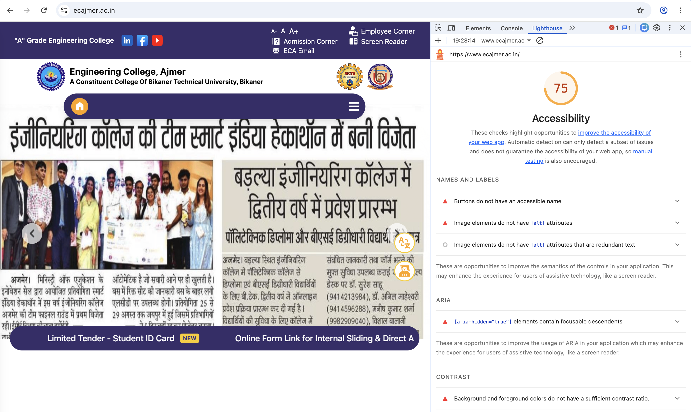
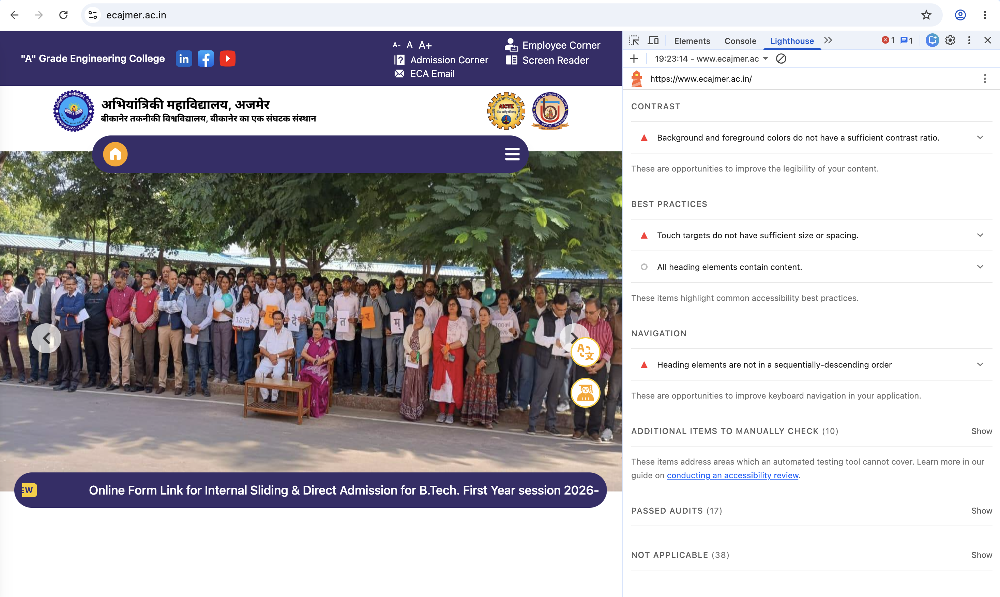

# Accessibility Baseline & Repository Architecture Audit

## 1. Website Audited

- **Website:** Engineering College Ajmer
- **URL:** https://www.ecajmer.ac.in/
- **Audit Tool:** Google Chrome Lighthouse
- **Audit Category:** Accessibility
- **Device Mode:** Desktop
- **Lighthouse Accessibility Score:** 75/100

## 2. Audit Objective

The purpose of this audit is to identify accessibility issues that may affect users, especially users who rely on assistive technologies, keyboard navigation, or have visual or motor accessibility needs.

The audit combines automated Lighthouse findings with manual accessibility checks.

## 3. Lighthouse Summary

Lighthouse reported an accessibility score of **75/100**.

The automated audit identified issues related to:

- Accessible names for buttons
- Alternative text for images
- ARIA usage
- Color contrast
- Touch target size and spacing
- Heading structure  

## 4. Accessibility Issues Identified

### Issue 1 — Buttons do not have an accessible name

- **Finding:** Buttons on the website do not have accessible names.
- **Evidence:** Lighthouse identified buttons without an accessible name. Screen readers may announce an unnamed control only as "button", making it difficult for users to understand its purpose.
- **Impact:** Users who rely on screen readers may not know what action the button performs.
- **Remediation:** Provide every interactive button with a meaningful accessible name. Use visible button text where possible. For icon-only buttons, provide an appropriate accessible label such as `aria-label`.
- **Priority:** High
- **Source:** Chrome Lighthouse Accessibility audit

### Issue 2 — Images do not have `alt` attributes

- **Finding:** Some images on the website do not have alternative text (`alt` attributes).
- **Evidence:** Lighthouse reported images with missing `alt` attributes.
- **Impact:** Screen-reader users may not receive information about the purpose or content of these images.
- **Remediation:** Add meaningful `alt` text to informative images. For decorative images, use an empty `alt=""` so assistive technologies can ignore them.
- **Priority:** High
- **Source:** Chrome Lighthouse Accessibility audit

### Issue 3 — `aria-hidden="true"` elements contain focusable descendants

- **Finding:** Lighthouse detected focusable elements inside an element marked with `aria-hidden="true"`.
- **Evidence:** The Lighthouse Accessibility audit reported: "`[aria-hidden="true"]` elements contain focusable descendants."
- **Impact:** Keyboard users and screen-reader users may encounter interactive elements that are visually or semantically hidden from assistive technologies. This can create confusion and make navigation difficult.
- **Remediation:** Do not place focusable elements such as links, buttons, or form controls inside an `aria-hidden="true"` container. Either remove `aria-hidden="true"` when the content should be accessible or make the contained elements non-focusable when the content is intentionally hidden.
- **Priority:** High
- **Source:** Chrome Lighthouse Accessibility audit

### Issue 4 — Background and foreground colors do not have sufficient contrast

- **Finding:** Some text and background color combinations on the website do not provide sufficient contrast.
- **Evidence:** Lighthouse reported that background and foreground colors do not have sufficient contrast.
- **Impact:** Users with low vision or color-vision difficulties may have difficulty reading the affected content.
- **Remediation:** Adjust the foreground and background colors to meet WCAG contrast requirements. Test the updated color combinations with an accessibility contrast checker.
- **Priority:** Medium
- **Source:** Chrome Lighthouse Accessibility audit

### Issue 5 — Touch targets do not have sufficient size or spacing

- **Finding:** Some interactive touch targets on the website are too small or too close together.
- **Evidence:** Lighthouse reported that touch targets do not have sufficient size or spacing.
- **Impact:** Users on touch devices, particularly users with motor difficulties, may accidentally activate the wrong control.
- **Remediation:** Increase the clickable area of interactive controls and provide adequate spacing between neighboring touch targets. Ensure important controls meet recommended minimum target sizes.
- **Priority:** Medium
- **Source:** Chrome Lighthouse Accessibility audit

## 5. Keyboard-Only Navigation Audit

A manual keyboard-only navigation test was performed on the Engineering College Ajmer website.

### Test Method

- Mouse was not used during the navigation test.
- `Tab` was used to move between interactive elements.
- `Enter` was used to activate focused links/buttons.
- Focus visibility and navigation order were observed.

### Observations

- Keyboard focus was tested across the website's interactive elements.
- Navigation was checked for logical movement between links and controls.
- Interactive elements were tested using the keyboard.
- The keyboard-only pass was used as a manual complement to the automated Lighthouse audit.

### Result

The keyboard-only navigation test was completed successfully as a manual accessibility check. Lighthouse findings were documented separately because automated and manual testing identify different types of accessibility problems.

## 6. Evidence

The following screenshots were captured during the accessibility audit using Chrome Lighthouse.

### Evidence 1 — Buttons without accessible names

Lighthouse identified buttons that do not have accessible names.

**Screenshot:** Lighthouse "Buttons do not have an accessible name" finding.

### Evidence 2 — Images without `alt` attributes

Lighthouse identified images that do not contain alternative text.

**Screenshot:** Lighthouse "Image elements do not have `[alt]` attributes" finding.

### Evidence 3 — `aria-hidden="true"` with focusable descendants

Lighthouse identified focusable elements inside an `aria-hidden="true"` element.

**Screenshot:** Lighthouse ARIA finding.

### Evidence 4 — Insufficient color contrast

Lighthouse identified foreground and background color combinations with insufficient contrast.

**Screenshot:** Lighthouse contrast finding.

### Evidence 5 — Insufficient touch-target size or spacing

Lighthouse identified touch targets that do not have sufficient size or spacing.

**Screenshot:** Lighthouse touch-target finding.

### Keyboard Navigation Evidence

A manual keyboard-only navigation test was also performed using the `Tab` and `Enter` keys.
